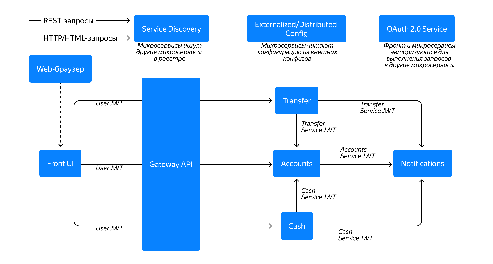

# Микросервисное приложение «Банк» с использованием Spring Boot, интеграций Spring Cloud и паттернов микросервисной архитектуры.

## Архитектура проекта


## Компоненты
| name                 | docker                    | port |
|----------------------|---------------------------|------|
| front                | bank-front                | 9000 |
| gateway              | bank-gateway              | 9001 |
| keycloak             | bank-keycloak             | 9002 |
| transfer service     | bank-transfer-service     | 9003 |
| cash service         | bank-cash-service         | 9004 |
| account service      | bank-account-service      | 9005 |
| notification service | bank-notification-service | 9006 |
| consul               | bank-consul               | 8500 |
| transfer db          | bank-transfer-db          | 9003 |
| cash db              | bank-cash-db              | 9004 |
| account db           | bank-account-db           | 9005 |
| notification db      | bank-notification-db      | 9006 |

## Запуск сервисов
```bash
docker compose up
```
## Что выполнено
Смотри pull-реквесты.


