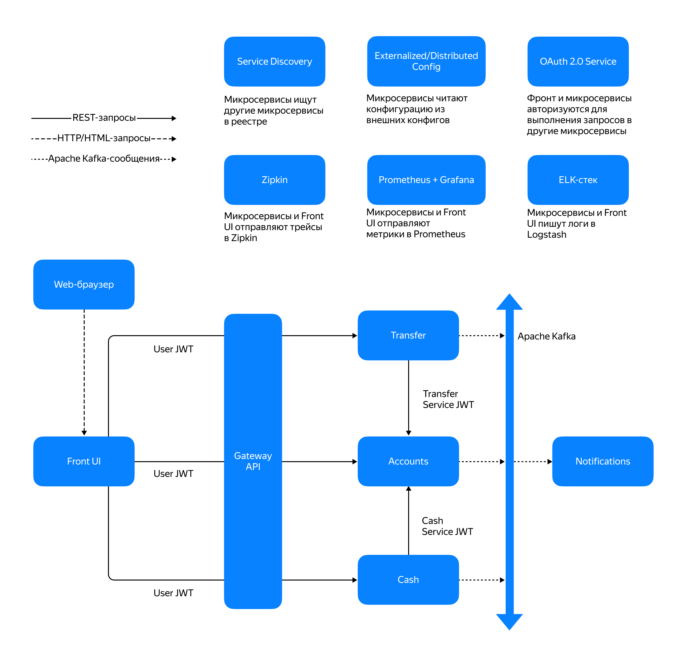

# Микросервисное приложение «Банк» с использованием Spring Boot, интеграций Spring Cloud и паттернов микросервисной архитектуры.

## Задание
Доработать микросервисное приложение «Банк» (https://github.com/ugaforever/bank-platform-microservices/tree/module_three_sprint_eleven_branch):
1. Трейсинг запросов с использованием системы распределённых трассировок Zipkin.
2. Мониторинги/графики метрик и алерты с использованием Prometheus и Grafana.
3. Логирование с использованием ELK-стека.

## Обновленная схема с трейсингом, метриками и логгированием



## Компоненты
| name                 | docker                    | port |
|----------------------|---------------------------|------|
| front                | bank-front                | 9000 |
| gateway              | bank-gateway              | 9001 |
| keycloak             | bank-keycloak             | 9002 |
| transfer service     | bank-transfer-service     | 9003 |
| cash service         | bank-cash-service         | 9004 |
| account service      | bank-account-service      | 9005 |
| notification service | bank-notification-service | 9006 |
| consul               | bank-consul               | 8500 |
| transfer db          | bank-transfer-db          | 5433 |
| cash db              | bank-cash-db              | 5434 |
| account db           | bank-account-db           | 5435 |
| notification db      | bank-notification-db      | 5436 |
| debezium             | bank-debezium             | 8083 |
| elasticsearch        | bank-elasticsear          | 9200 |
| kibana               | bank-kibana               | 5601 |
| logstash             | bank-logstash             | 5044 |
| zipkin               | bank-zipkin               | 9411 |
| prometheus           | bank-prometheus           | 9090 |
| kafka                | bank-kafka                | 9092 |
| alertmanager         | bank-alertmanager         | 9093 |
| grafana              | bank-grafana              | 3000 |


## Запуск
1. Jenkins
```bash
   java -Dhudson.plugins.git.GitSCM.ALLOW_LOCAL_CHECKOUT=true -jar jenkins.war
```
В Jenkins через админ-панель добавляем пароли DB_PASSWORD,ACCOUNT_PASSWORD,CASH_PASSWORD,TRANSFER_PASSWORD,NOTIFICATION_PASSWORD

2. Keycloak
```bash
   docker compose up -d bank-keycloak
   ./keycloak/create_users.sh
```   

3. Helm
```bash
cd ./helm/
helm dependency update
helm dependency build
helm dependency list
```

4. Проверка корректности
```bash
helm template my-app .
helm install my-app . --dry-run --debug
helm lint .
```

5. Установка
```bash
helm upgrade --install bank ./helm/ \
  --namespace test --create-namespace \
  -f ./helm/values.yaml \
  -f ./environments/test/values.yaml \
  --set kafka.enabled=true \
  --set zipkin.enabled=true \
  --set prometheus.enabled=true \
  --set grafana.enabled=true \
  --set account-db.enabled=true \
  --set cash-db.enabled=true \
  --set transfer-db.enabled=true \
  --set notification-db.enabled=true
```

6. Записи в hosts
```bash
sudo nano /etc/hosts
127.0.0.1 account.bank.local
127.0.0.1 cash.bank.local
127.0.0.1 transfer.bank.local
127.0.0.1 notification.bank.local
```

## Pipeline Jenkins
Интеграция в Jenkins (Jenkinsfile).

## Что выполнено
В описании pull-реквестов.

## Обратная связь / ревью
В чате практикума.


